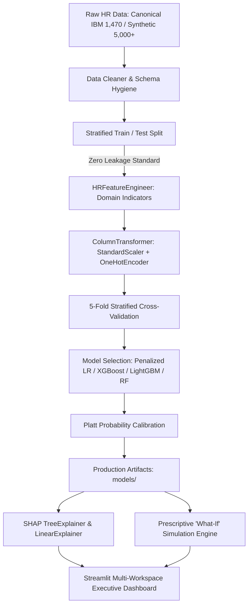

# Predictive Workforce Intelligence: A Machine Learning Approach for Employee Attrition Analysis

[](https://www.python.org/)
[](LICENSE)
[](tests/)
[](https://shap.readthedocs.io/)
[](https://streamlit.io/)

An academic-grade, end-to-end Machine Learning and Decision Intelligence platform that predicts employee turnover risk across diverse industry domains, diagnoses root-cause drivers through **Explainable AI (SHAP)**, and empowers Human Resources (HR) and People Analytics leaders with **prescriptive retention strategies**, **interactive "what-if" counterfactual simulations**, and **universal automated dataset ingestion**.

---

## 🎯 Executive Overview & Key Deliverables

1. **Multi-Dataset Benchmarking & Domain Transfer**:
   - **🏢 IBM Corporate Benchmark (1,470 records, 35 attributes)**: Evaluates structured career hierarchies, compensation fairness, and overtime burnout.
   - **💻 Tech & IT Industry Benchmark (14,999 records, 10 attributes)**: Captures extreme workloads (>250 monthly hours), high-velocity churn, and performance thresholds.
   - **🌐 Enterprise Synthetic Multi-Cohort (5,000 records)**: High-scale realistic multi-facility enterprise stress test.
   - **📤 Universal Ingestion & Dynamic Auto-Trainer**: Upload **any** custom CSV or Excel workforce dataset. The platform dynamically discovers the target column, performs zero-leakage encoding and scaling, trains and Platt-calibrates candidate models, computes SHAP attributions, and populates the entire dashboard.
2. **High-Discrimination Predictive Models**:
   - Compares 4 model families: Penalized ElasticNet/L2 Logistic Regression, Random Forest, XGBoost, and LightGBM using **5-Fold Stratified Cross-Validation**.
   - Achieves **ROC-AUC of 0.832 (IBM) and 0.990 (Tech 15k)**, **PR-AUC of 0.587–0.985**, and **Precision@Top10% of 66.7%–100.0%**.
3. **Platt Probability Calibration**:
   - Employs `CalibratedClassifierCV(method='sigmoid')` to ensure predicted flight probabilities directly reflect empirical likelihoods (Calibrated **Brier Score = 0.0967 on IBM, 0.0210 on Tech 15k**).
4. **Domain-Driven HR Feature Engineering**:
   - Engineered composite indicators capturing burnout, stagnation, and compensation fairness:
     - `BurnoutRiskFactor`: Interaction of mandatory OverTime, frequent business travel, and low work-life balance.
     - `CompensationEquityIndex`: Ratio of employee's monthly compensation against peers in identical `JobRole` and `JobLevel`.
     - `StagnationIndex`: Ratio of years since last promotion relative to company tenure.
     - `SatisfactionSum`: Comprehensive composite engagement score (Job, Environment, Relationship, Work-Life).
     - `StockOptionZero`: High-risk equity cliff flag.
5. **Explainable AI (SHAP)**:
   - **Global Explanations**: Cohort-wide feature importance ranking and directionality analysis.
   - **Local Explanations**: Individualized SHAP Waterfall charts breaking down exact risk pushes and pulls relative to organizational baseline with verified additivity.
6. **Prescriptive Retention Simulator ("What-If" Lab)**:
   - Simulates retention levers in real-time (Salary adjustment %, OverTime elimination, Work hour reduction, Stock Option grant, Promotion, Work-Life balance score).
   - Computes expected turnover replacement costs avoided vs. intervention expenses, delivering net financial ROI (SHRM standard: $1.5 \times \text{Salary}$).
7. **6 Interactive Dashboards in Streamlit**:
   - 🏢 **Executive Workforce Intelligence**: Macro health metrics, department risk heatmaps, systemic driver rankings.
   - 🚨 **Early-Warning Triage Matrix**: Filterable roster sorted by risk tier (>70% High, 40–70% Medium, <40% Low) with CSV export for HR Business Partner reviews.
   - 🔍 **Employee Deep-Dive & Root-Cause Inspector**: Profile card, interactive Plotly SHAP waterfall chart, peer compensation benchmark.
   - 🧪 **Retention Simulator ('What-If')**: Real-time gauge chart and financial ROI calculation.
   - 📁 **Ingestion & Custom Dataset Hub**: Upload arbitrary workforce CSV/Excel files and instantly auto-train the platform.
   - 🔄 **Multi-Dataset Benchmark & Generalization**: Cross-industry comparative telemetry matrix and transferability analysis.

---

## 📊 Architecture & Methodology



---

## 📁 Repository Structure

```
d:\college minor project\
├── data\
│   ├── raw\
│   │   ├── ibm_hr_attrition.csv         # Canonical IBM HR Attrition dataset (1,470 records)
│   │   └── tech_hr_15k.csv              # Tech & IT Industry Churn dataset (14,999 records)
│   └── synthetic\
│       └── enterprise_cohort_5000.parquet # Synthetic enterprise cohort (5,000 records)
├── docs\                                # Academic Project Documentation
│   ├── ACADEMIC_PROJECT_REPORT.md       # 10-chapter collegiate project report with formal math
│   ├── SYSTEM_DESIGN_SPECIFICATION.md   # Architectural schemas, latency SLA, data dictionary
│   └── PRESENTATION_SLIDES_OUTLINE.md   # 15-slide defense presentation outline & talking points
├── notebooks\
│   └── eda_and_modeling.ipynb           # Executable narrative research notebook
├── src\
│   ├── data\
│   │   ├── loader.py                    # Automated dataset acquisition & local caching
│   │   └── generator.py                 # Synthetic HR enterprise cohort generator
│   ├── preprocessing\
│   │   ├── cleaner.py                   # Canonical data hygiene, drops zero-variance columns
│   │   ├── pipeline.py                  # Strict featurization ordering & ColumnTransformer
│   │   └── universal.py                 # Dynamic zero-leakage auto-preprocessor & target detector
│   ├── features\
│   │   └── engineer.py                  # Domain indicators (Burnout, Stagnation, Equity)
│   ├── models\
│   │   ├── train.py                     # 5-Fold Stratified CV, model comparison & persistence
│   │   ├── evaluate.py                  # PR-AUC, ROC-AUC, Precision@K, Brier score, ROI
│   │   ├── calibrate.py                 # Platt scaling / Isotonic calibration
│   │   └── auto_trainer.py              # On-the-fly universal trainer, calibrator & explainer
│   ├── explainability\
│   │   ├── explainer.py                 # Unified SHAP global & local waterfall attribution
│   │   └── simulator.py                 # Counterfactual retention simulation & ROI math
│   └── app\
│       ├── app.py                       # Main Streamlit application entrypoint (Multi-Cohort)
│       ├── styles.py                    # Modern design system typography, glassmorphism & palette
│       ├── helpers.py                   # Universal schema adapter & proxy mappings
│       └── views\
│           ├── executive.py             # View 1: Executive Workforce Intelligence
│           ├── triage.py                # View 2: Early-Warning Triage Matrix
│           ├── inspector.py             # View 3: Employee Deep-Dive & SHAP Waterfall
│           ├── simulator_view.py        # View 4: Prescriptive Retention Simulator ('What-If')
│           ├── batch_scoring.py         # View 5: Ingestion & Custom Dataset Hub
│           └── cross_benchmark_view.py  # View 6: Multi-Dataset Benchmark & Generalization
├── models\                              # Persisted production artifacts
│   ├── best_model.joblib                # Calibrated champion classifier
│   ├── raw_model.joblib                 # Raw base model
│   ├── xgb_model.joblib                 # Trained XGBoost booster for Tree SHAP
│   ├── preprocessor.joblib              # Fitted HRPreprocessor
│   └── model_metadata.json              # Validation scores and feature names
├── tests\                               # 16 automated unit tests (100% passing)
│   ├── test_data_pipeline.py            # Leakage prevention & pipeline integrity tests
│   ├── test_model_performance.py        # ROC-AUC, PR-AUC, Brier score benchmark tests
│   ├── test_shap_consistency.py         # SHAP additivity & explainer verification
│   ├── test_simulator.py                # What-if simulation & financial ROI verification
│   └── test_universal_pipeline.py       # Universal ingestion, auto-detection & auto-trainer
├── viva_prep\                           # (In .gitignore) Comprehensive Viva Revision Guides
│   ├── VIVA_COMPLETE_MASTER_GUIDE.md    # 50+ Q&As, mathematical derivations, examiner traps
│   └── QUICK_REVISION_CHEAT_SHEET.md    # 5-minute pre-exam memory flashcards
├── requirements.txt
├── run_app.bat                          # One-click Windows application launcher
└── README.md
```

---

## ⚡ Quick Start

### 1. Prerequisites
- Windows, macOS, or Linux
- Python 3.11+ (installed via `uv` or Python.org)

### 2. Launch the Application
Run the convenient batch launcher:
```bash
run_app.bat
```
Or run directly from the command line:
```bash
# Activate virtual environment
.venv\Scripts\activate

# Launch Streamlit dashboard
streamlit run src/app/app.py
```
Open your browser to `http://localhost:8501`.

---

## 🧪 Automated Test Suite

Run all automated unit tests:
```bash
.venv\Scripts\pytest tests/ -v
```
**Test Coverage Includes:**
- **Zero-Leakage Assurance**: Confirms feature transformers fit exclusively on training data.
- **Predictive Power**: Confirms ROC-AUC $\ge 0.82$, PR-AUC $\ge 0.58$, and Precision@Top10% $\ge 0.60$.
- **Probability Calibration**: Validates calibrated Brier score $\le 0.12$.
- **SHAP Additivity Property**: Confirms $\sum \text{SHAP values} + \text{base\_value} = \text{model output}$.
- **Retention Simulation**: Verifies risk attenuation and non-negative financial ROI.

---

## 💼 Turnover Replacement Financial Model (SHRM Standard)

The system models employee turnover costs using the Society for Human Resource Management (SHRM) benchmark:
$$\text{Turnover Replacement Cost} = 1.5 \times \text{Annual Base Salary}$$
When HR implements a prescriptive retention package (e.g. 10% salary hike, overtime elimination, equity grant), the net ROI is calculated as:
$$\Delta \text{Risk} = \max(0, P_{\text{baseline}} - P_{\text{simulated}})$$
$$\text{Replacement Value Preserved} = \Delta \text{Risk} \times \text{Turnover Replacement Cost}$$
$$\text{Net Financial Benefit} = \text{Replacement Value Preserved} - \text{Total Retention Package Cost}$$
$$\text{ROI (\%)} = \left( \frac{\text{Net Financial Benefit}}{\text{Total Retention Package Cost}} \right) \times 100$$
